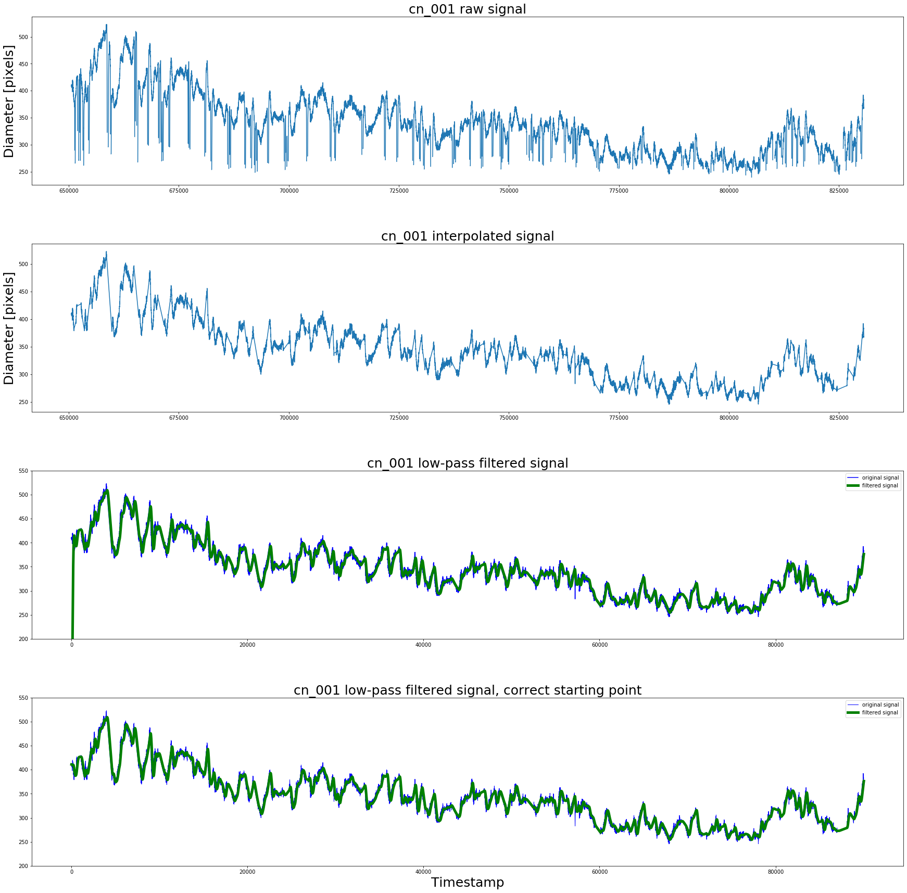

# Example figures made with Python

# code (Matlab, R, Python)
This repo contains code that I've created for several data analysis techniques.

Code includes:
(i) pre-processing
(ii) 1st- and 2nd level analyses
(iii) plotting

